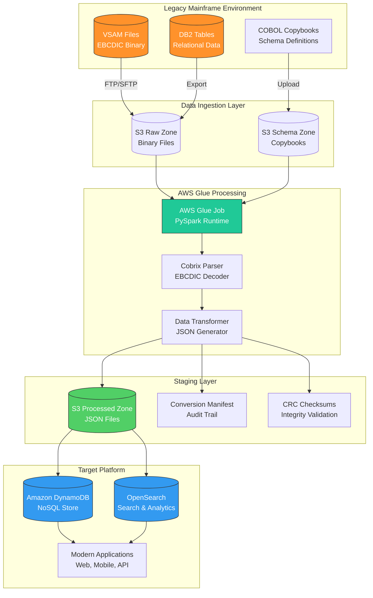
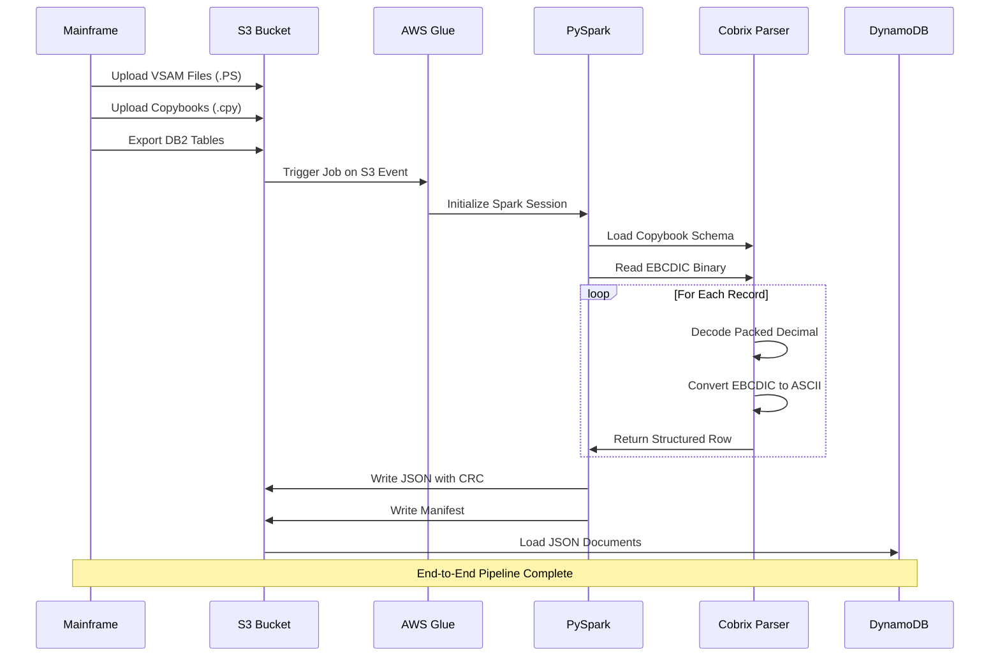
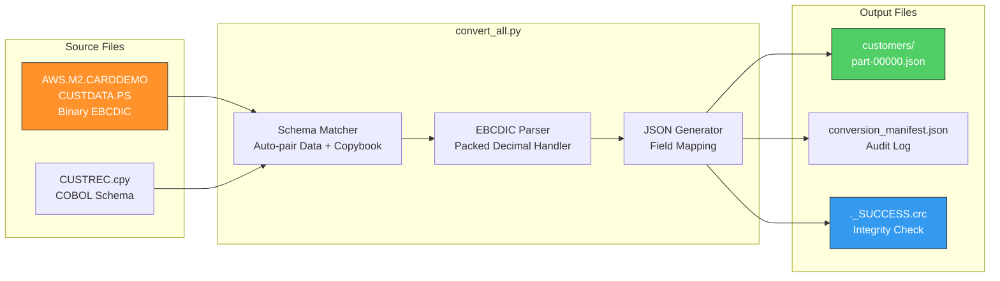
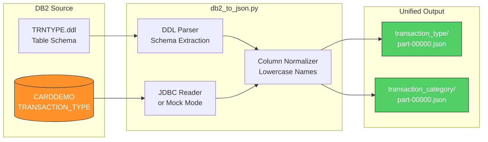
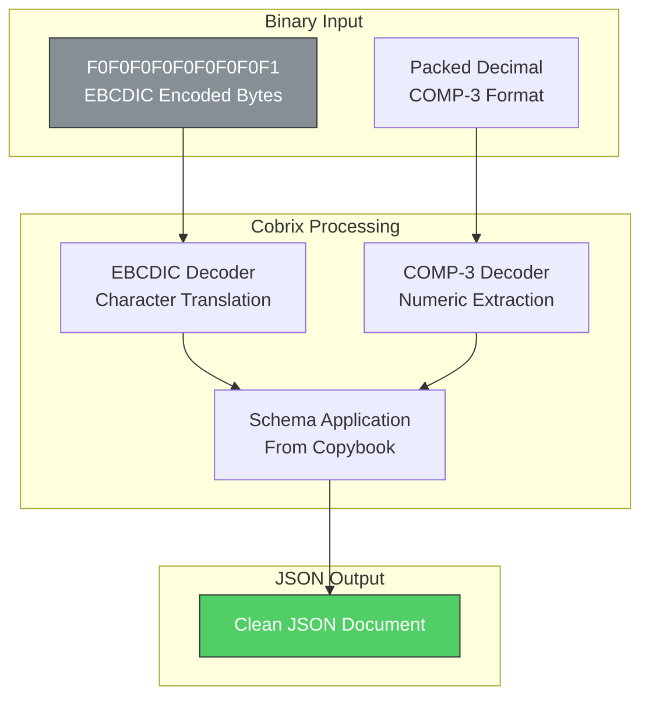
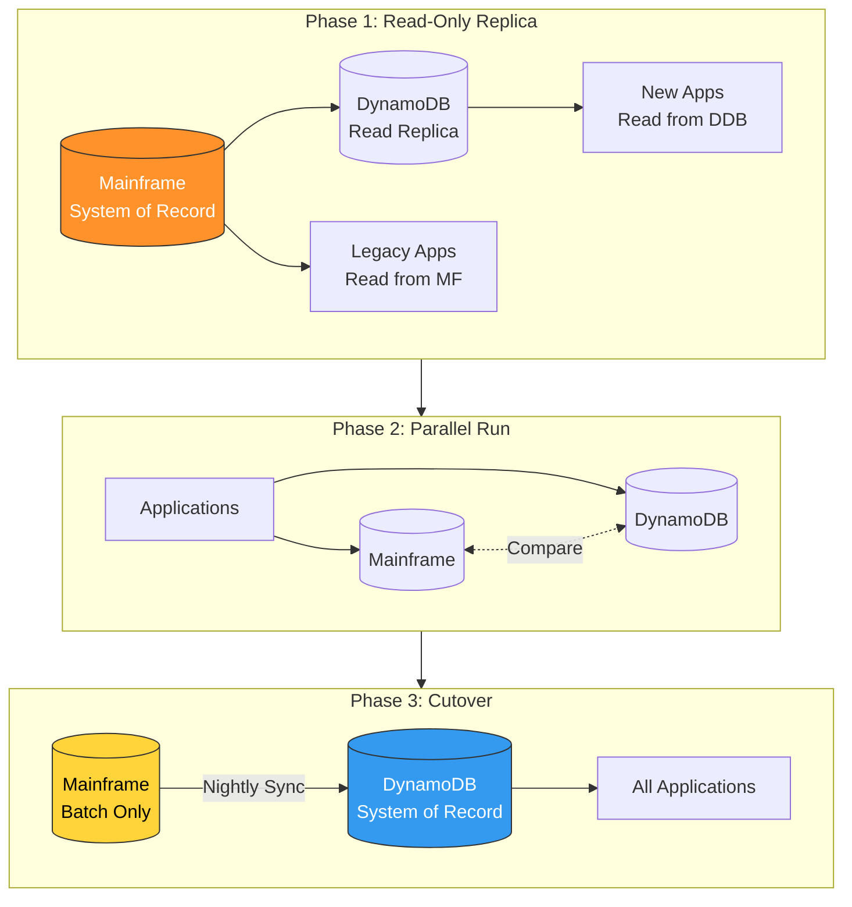
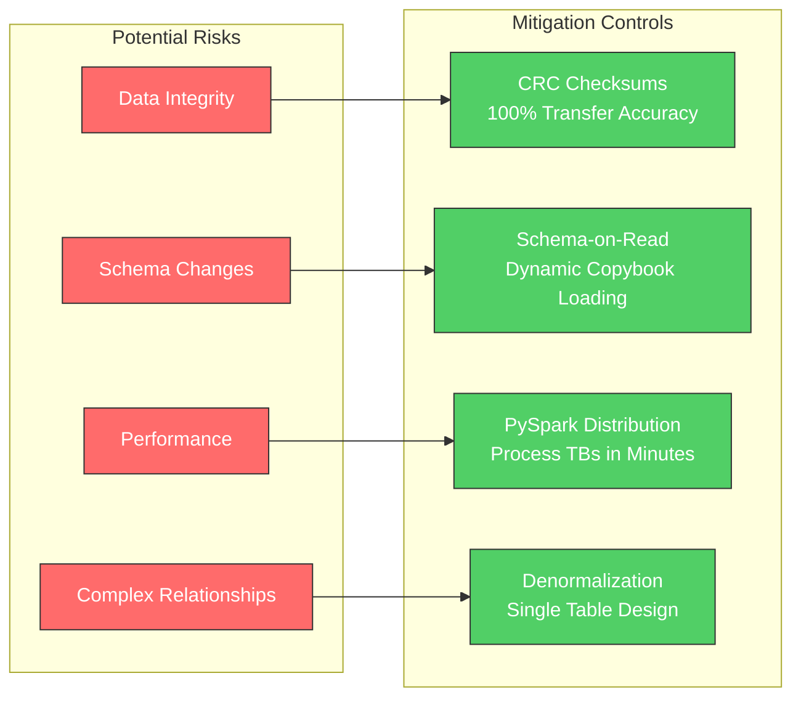
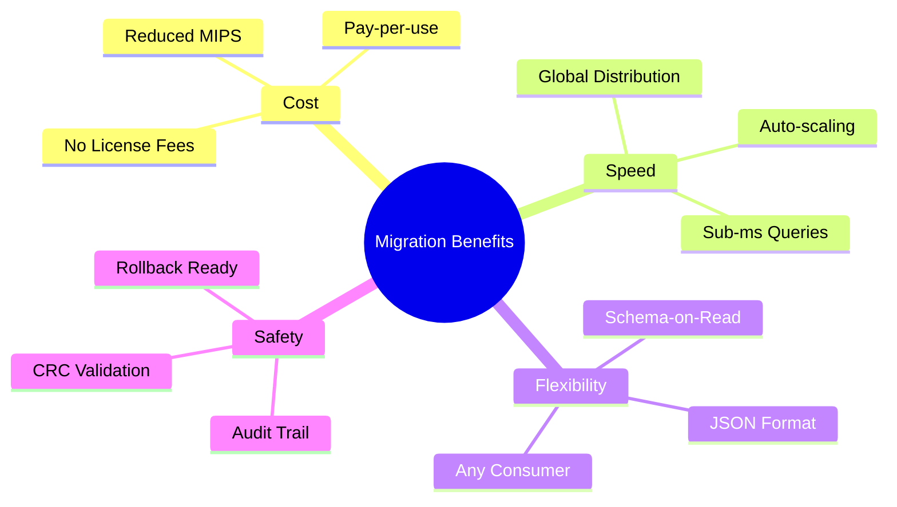

# Mainframe to DynamoDB Migration

> **Modernizing Mission-Critical Data**: A pattern for migrating mainframe assets to AWS DynamoDB via Glue & PySpark

Local testing environment for converting AWS CardDemo EBCDIC mainframe data to JSON format, mimicking AWS Glue 5.0 runtime.

---

## Table of Contents

- [Overview](#overview)
- [Architecture](#architecture)
- [Data Pipeline](#data-pipeline)
- [Migration Strategy](#migration-strategy)
- [Quick Start](#quick-start)
- [Dataset Reference](#dataset-reference)
- [Business Value](#business-value)
- [Troubleshooting](#troubleshooting)

---

## Overview

### The Challenge: Data Silos

| Constraint | Impact |
|------------|--------|
| **Legacy Format** | Data locked in proprietary binary formats (EBCDIC, VSAM) |
| **Complexity** | Requires COBOL knowledge just to read the data |
| **Cost** | MIPS compute costs consumed on every query |
| **Rigidity** | Adding a field requires recompiling and potential downtime |

### The Solution: Automated Transformation Pipeline

| Component | Technology | Purpose |
|-----------|------------|---------|
| **ETL Engine** | AWS Glue 5.0 | Serverless data processing |
| **Processing** | Apache Spark + PySpark | Distributed computing |
| **Parser** | Cobrix 2.6.9 | EBCDIC/COBOL Copybook handling |
| **Target** | Amazon DynamoDB | NoSQL data store |
| **Intermediate** | JSON | Universal data format |

**Key Innovation**: We use the original COBOL Copybooks to drive the transformation, ensuring 100% accuracy without manual field mapping.

---

## Architecture

### High-Level System Architecture



### Component Interaction Flow



---

## Data Pipeline

### VSAM to JSON Conversion Pipeline



### DB2 to JSON Conversion Pipeline



### Data Transformation Detail



**Before (COBOL Copybook)**:
```cobol
01  CUSTOMER-RECORD.
    05  CUST-ID              PIC 9(09).
    05  CUST-FIRST-NAME      PIC X(25).
    05  CUST-LAST-NAME       PIC X(25).
    05  CUST-FICO-SCORE      PIC 9(03).
```

**After (JSON Output)**:
```json
{
  "CUST_ID": 1,
  "CUST_FIRST_NAME": "Immanuel",
  "CUST_LAST_NAME": "Kessler",
  "CUST_FICO_CREDIT_SCORE": 274
}
```

---

## Migration Strategy

### Incremental Migration Phases



### Phase Details

| Phase | Description | Risk Level | Status |
|-------|-------------|------------|--------|
| **Phase 1** | Read-Only Replica - New apps read from DynamoDB, legacy unchanged | Near Zero | Current Focus |
| **Phase 2** | Parallel Run - Writes to both systems, compare for consistency | Low | Planned |
| **Phase 3** | Cutover - DynamoDB becomes System of Record | Medium | Future |

### Risk Mitigation



---

## Quick Start

### Prerequisites

1. **Java 17+** (21 recommended)
   ```bash
   java -version
   # Should show: openjdk version "17.x.x" or higher
   ```

2. **Python 3.10 or 3.11**
   ```bash
   python3 --version
   # Should show: Python 3.10.x or 3.11.x
   ```

3. **UV Package Manager**
   ```bash
   curl -LsSf https://astral.sh/uv/install.sh | sh
   ```

### Installation

```bash
cd mainframe-migration
uv sync
```

### Run Conversion

```bash
# Convert all VSAM datasets
uv run python convert_all.py

# Convert DB2 tables
uv run python db2/scripts/db2_to_json.py

# Quick test (customers only)
uv run python local_test.py
```

### Verify Output

```bash
# Check conversion results
cat output/conversion_manifest.json

# View sample customer record
head -1 output/customers/*.json | python -m json.tool
```

---

## Dataset Reference

### VSAM Datasets (Converted)

| Dataset | Source File | Copybook | Records | Description |
|---------|-------------|----------|---------|-------------|
| customers | CUSTDATA.PS | CUSTREC.cpy | 50 | Customer demographics |
| accounts | ACCTDATA.PS | CVACT01Y.cpy | 50 | Account balances & limits |
| cards | CARDDATA.PS | CVACT02Y.cpy | 50 | Credit card details |
| card_xref | CARDXREF.PS | CVACT03Y.cpy | 50 | Card-customer mapping |
| daily_transactions | DALYTRAN.PS | CVTRA06Y.cpy | 300 | Transaction history |
| transaction_types | TRANTYPE.PS | CVTRA03Y.cpy | 7 | Type reference data |
| transaction_categories | TRANCATG.PS | CVTRA04Y.cpy | 18 | Category reference |
| users | USRSEC.PS | CSUSR01Y.cpy | 10 | User credentials |
| discount_groups | DISCGRP.PS | DISCGRP.cpy | 51 | Discount configuration |
| category_balances | TCATBALF.PS | TCATBALF.cpy | 50 | Category summaries |
| export_data | EXPORT.DATA.PS | CVEXPORT.cpy | 500 | Multi-record export |

### DB2 Tables (Converted)

| Table | Source | Records | Description |
|-------|--------|---------|-------------|
| transaction_type | CARDDEMO.TRANSACTION_TYPE | 7 | Transaction type codes |
| transaction_type_category | CARDDEMO.TRANSACTION_TYPE_CATEGORY | 18 | Category mappings |

### Conversion Summary

```
Total Datasets: 13
Total Records: 1,161
Success Rate: 100%
Output Format: JSON (DynamoDB-ready)
```

---

## Business Value

### ROI Summary

| Benefit | Impact |
|---------|--------|
| **Cost Reduction** | Offload read-heavy queries from Mainframe (MIPS savings) to DynamoDB (Pay-per-request) |
| **Agility** | New products launch in days using JSON APIs, vs months of COBOL development |
| **Data Democratization** | Data in standard JSON format readable by Data Lakes, AI/ML tools, Analytics dashboards |
| **Talent Pool** | Python/Cloud skills widely available vs scarce COBOL specialists |

### Technical Advantages



---

## Project Structure

```
mainframe-migration/
├── input/                      # Source files
│   ├── *.PS                    # EBCDIC binary data files
│   └── *.cpy                   # COBOL copybook schemas
├── output/                     # Converted JSON output
│   ├── customers/
│   ├── accounts/
│   ├── cards/
│   ├── daily_transactions/
│   └── conversion_manifest.json
├── db2/                        # DB2 migration
│   ├── schema/source/          # DDL definitions
│   ├── scripts/                # Conversion scripts
│   └── output/                 # DB2 JSON output
├── docs/                       # Documentation
│   ├── DESIGN.md               # Technical design
│   └── executive-presentation.html
├── convert_all.py              # Main VSAM conversion script
├── local_test.py               # Quick test script
├── pyproject.toml              # Python dependencies
└── README.md                   # This file
```

---

## Troubleshooting

### Common Issues

| Issue | Solution |
|-------|----------|
| `ClassNotFoundException: za.co.absa.cobrix` | Cobrix JAR downloads automatically. Check internet connectivity. |
| `IllegalAccessError: module java.base` | Java 17+ requires `--add-opens` flags. Already configured in scripts. |
| `Record length mismatch` | Verify copybook matches data file. Check RECLN comments. |

### Verify Environment

```bash
# Check Java version (must be 17+)
java -version

# Check Python version
python3 --version

# Clean rebuild
rm -rf .venv output uv.lock
uv sync
uv run python convert_all.py
```

---

## AWS Glue Deployment

For production deployment to AWS Glue 5.0:

1. Upload `convert_all.py` to S3
2. Upload Cobrix JAR to S3
3. Create Glue job with:
   - Glue Version: 5.0
   - Worker Type: G.1X or higher
   - Extra JARs: `s3://bucket/spark-cobol_2.12-2.6.9.jar`

See [docs/DESIGN.md](docs/DESIGN.md) for detailed production guide.

---

## References

- [Cobrix - COBOL Data Source for Spark](https://github.com/AbsaOSS/cobrix)
- [AWS Glue Documentation](https://docs.aws.amazon.com/glue/)
- [AWS CardDemo Application](https://github.com/aws-samples/aws-mainframe-modernization-carddemo)
- [DynamoDB Best Practices](https://docs.aws.amazon.com/amazondynamodb/latest/developerguide/best-practices.html)

---

## License

This project is for internal use. The CardDemo application is licensed under Apache 2.0 by AWS.
