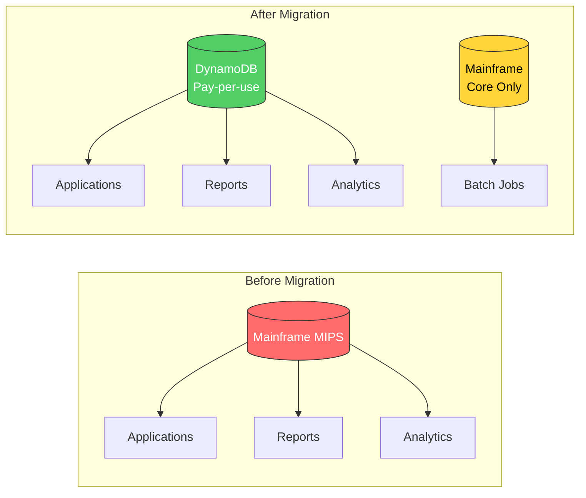
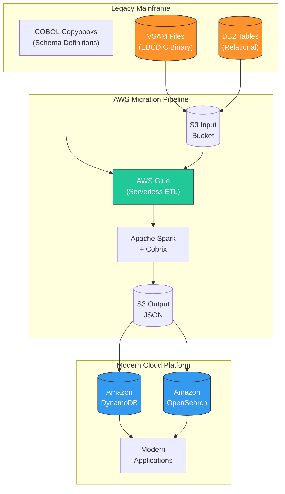
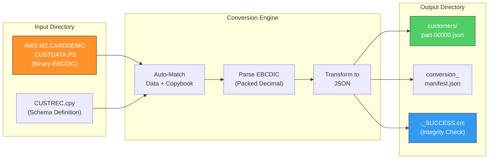
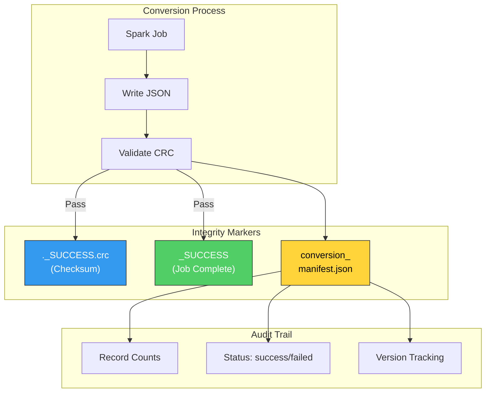
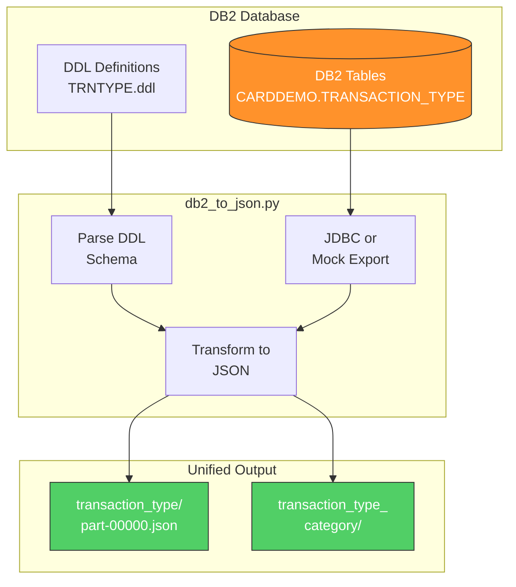
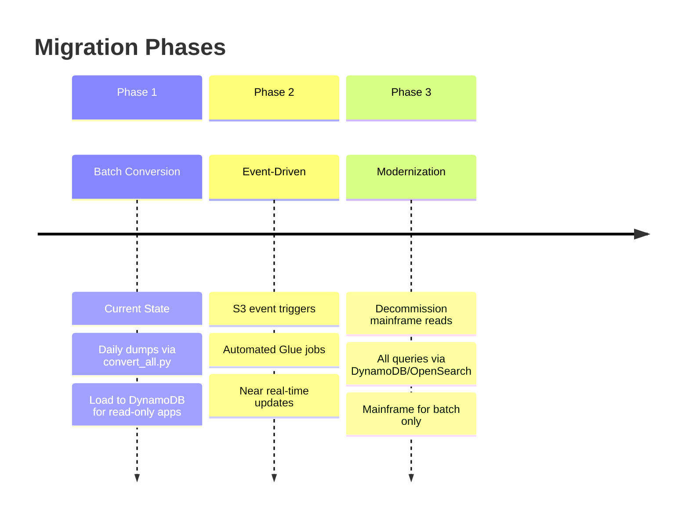
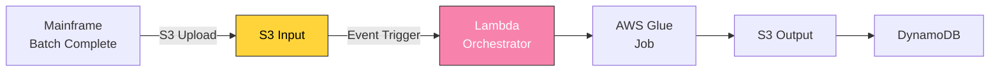
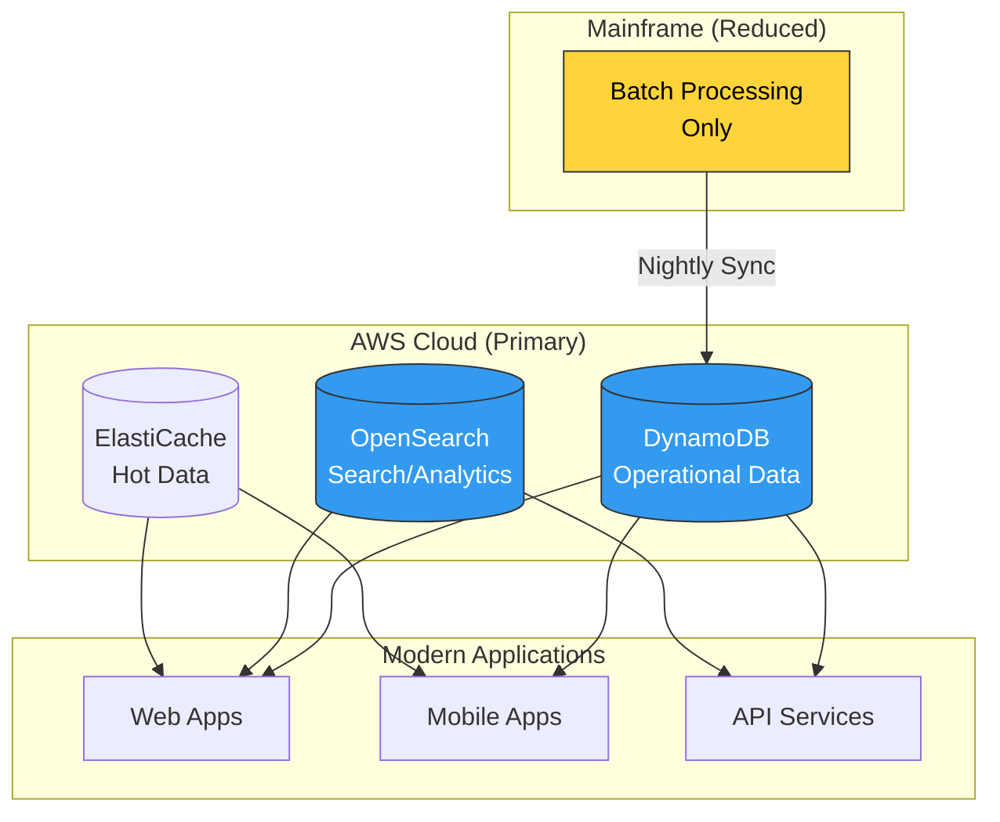
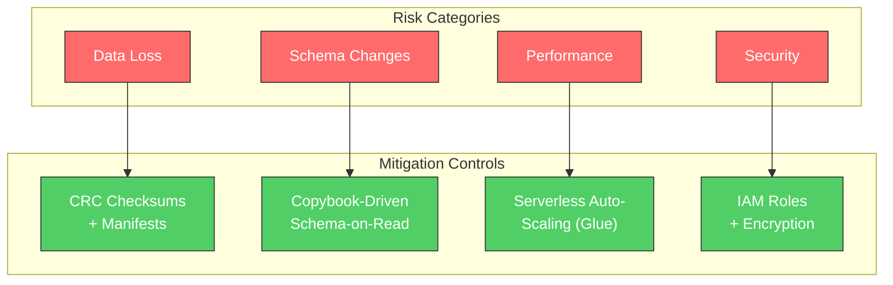
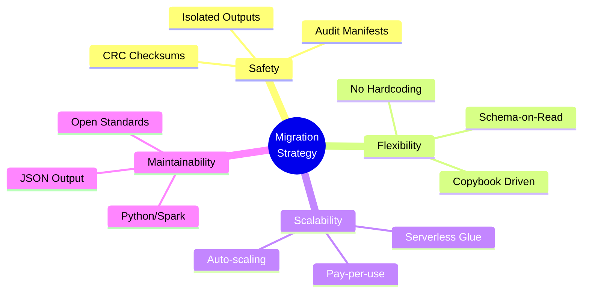

# Mainframe to NoSQL: Technical Deep Dive & Migration Strategy

## Executive Briefing Deck

---

# Table of Contents

1. [Executive Summary](#executive-summary)
2. [Business Value Proposition](#business-value-proposition)
3. [High-Level Architecture](#high-level-architecture)
4. [The Core Engine](#the-core-engine)
5. [Evidence of Success](#evidence-of-success)
6. [Data Integrity & Auditability](#data-integrity--auditability)
7. [DB2 Migration Path](#db2-migration-path)
8. [Production Roadmap](#production-roadmap)
9. [Risk Mitigation](#risk-mitigation)
10. [Appendix](#appendix)

---

# Executive Summary

## The Challenge

Our organization faces increasing costs from mainframe MIPS consumption, limited agility for new feature development, and a shrinking pool of COBOL expertise.

## The Solution

A serverless, cloud-native data migration pipeline that:
- **Decouples data** from expensive mainframe compute
- **Preserves data integrity** using original COBOL definitions
- **Enables modern applications** through industry-standard JSON format

## Key Results (Proof of Concept)

| Metric | Value |
|--------|-------|
| Datasets Converted | 11 |
| Total Records Processed | 1,136 |
| Success Rate | 100% |
| Data Format | JSON (DynamoDB-ready) |

---

# Business Value Proposition

## Cost Reduction



## Business Benefits

| Benefit | Impact |
|---------|--------|
| **MIPS Reduction** | Move read workloads off mainframe |
| **Scalability** | Auto-scaling cloud infrastructure |
| **Agility** | JSON enables rapid app development |
| **Talent Pool** | Python/Cloud skills vs COBOL specialists |

---

# High-Level Architecture

## End-to-End Data Flow



## Key Innovation: Schema-on-Read

Instead of manually mapping thousands of fields, we use the **original COBOL Copybooks** as the source of truth.

> **Result**: When mainframe teams change data structures, we simply upload the new Copybook. Zero code changes required.

---

# The Core Engine

## How convert_all.py Works



## Dataset Configuration

The engine automatically processes these mainframe datasets:

| Dataset | Source File | Records | Description |
|---------|-------------|---------|-------------|
| customers | AWS.M2.CARDDEMO.CUSTDATA.PS | 50 | Customer demographics |
| accounts | AWS.M2.CARDDEMO.ACCTDATA.PS | 50 | Account balances |
| cards | AWS.M2.CARDDEMO.CARDDATA.PS | 50 | Credit card info |
| daily_transactions | AWS.M2.CARDDEMO.DALYTRAN.PS | 300 | Transaction records |
| users | AWS.M2.CARDDEMO.USRSEC.PS | 10 | Security data |

---

# Evidence of Success

## COBOL Copybook to JSON Transformation

### Source Definition (CUSTREC.cpy)

```cobol
01  CUSTOMER-RECORD.
    05  CUST-ID                 PIC 9(09).
    05  CUST-FIRST-NAME         PIC X(25).
    05  CUST-LAST-NAME          PIC X(25).
    05  CUST-DOB-YYYYMMDD       PIC X(10).
    05  CUST-FICO-CREDIT-SCORE  PIC 9(03).
```

### Binary Input (Unreadable)

```
AWS.M2.CARDDEMO.CUSTDATA.PS
[500-byte fixed-length EBCDIC records]
```

### Actual JSON Output

```json
{
  "CUST_ID": 1,
  "CUST_FIRST_NAME": "Immanuel",
  "CUST_LAST_NAME": "Kessler",
  "CUST_DOB_YYYYMMDD": "1961-06-08",
  "CUST_FICO_CREDIT_SCORE": 274
}
```

## Conversion Proof

```mermaid
flowchart LR
    subgraph Binary["Mainframe Binary"]
        B1["F0F0F0F0F0F0F0F1<br/>(EBCDIC)"]
    end

    subgraph Readable["Human Readable"]
        R1['"CUST_ID": 1']
    end

    B1 -->|"Cobrix Parser"| R1

    style B1 fill:#868e96,stroke:#333,color:#fff
    style R1 fill:#51cf66,stroke:#333,color:#fff
```

---

# Data Integrity & Auditability

## Built-In Safety Mechanisms



## What This Means for You

| Safety Feature | Business Impact |
|----------------|-----------------|
| **CRC Checksums** | No partial/corrupt data enters production |
| **_SUCCESS Files** | Only complete jobs are promoted |
| **Manifest Tracking** | Full audit trail for compliance |
| **Isolated Folders** | accounts/, cards/, users/ - clean partitions |

## Conversion Manifest Sample

```json
{
  "datasets": [
    {"name": "customers", "status": "success", "record_count": 50},
    {"name": "accounts", "status": "success", "record_count": 50},
    {"name": "daily_transactions", "status": "success", "record_count": 300}
  ],
  "total_records": 1136,
  "cobrix_version": "2.6.9",
  "spark_version": "3.5.0"
}
```

---

# DB2 Migration Path

## Handling Relational Data



## DB2 Table Example

### DDL Definition (TRNTYPE.ddl)

```sql
CREATE TABLE CARDDEMO.TRANSACTION_TYPE
(   TR_TYPE        CHAR(2) NOT NULL,
    TR_DESCRIPTION VARCHAR(50) NOT NULL,
    PRIMARY KEY(TR_TYPE));
```

### Exported JSON

```json
{"tr_type": "01", "tr_description": "Purchase"}
{"tr_type": "02", "tr_description": "Cash Advance"}
{"tr_type": "04", "tr_description": "Payment"}
```

## Key Benefit: Homogenized Data Layer

Whether the source is:
- VSAM flat files (EBCDIC binary)
- DB2 relational tables

The downstream application sees **identical JSON format**.

---

# Production Roadmap

## Three-Phase Implementation



## Phase Details

### Phase 1: Batch Conversion (Current)


### Phase 2: Event-Driven Pipeline



### Phase 3: Full Modernization



---

# Risk Mitigation

## Identified Risks and Controls



## Risk Matrix

| Risk | Likelihood | Impact | Mitigation | Status |
|------|------------|--------|------------|--------|
| Data Loss | Low | High | CRC checksums, _SUCCESS markers | Implemented |
| Schema Drift | Medium | Medium | Copybook-driven parsing | Implemented |
| Performance | Low | Medium | Serverless auto-scaling | Designed |
| Security | Low | High | IAM, KMS encryption | Planned |
| Skill Gap | Medium | Low | Python/Spark (common skills) | Mitigated |

---

# Key Takeaways for Executives

## Why This Approach Works



## Summary Points

1. **Proven Technology**: Successfully converted 1,136 records across 11 datasets
2. **Zero Code Changes**: Copybook updates automatically adapt the pipeline
3. **Full Audit Trail**: Every file tracked with checksums and manifests
4. **Cost Efficient**: Serverless = pay only for what you use
5. **Future Ready**: JSON enables DynamoDB, OpenSearch, and any modern app

---

# Appendix

## Technology Stack

| Component | Technology | Purpose |
|-----------|------------|---------|
| ETL Engine | AWS Glue 5.0 | Serverless data processing |
| Processing | Apache Spark 3.5 | Distributed computing |
| COBOL Parser | Cobrix 2.6.9 | EBCDIC/Copybook handling |
| Language | Python 3.11 | Orchestration logic |
| Runtime | Java 17+ | Spark execution |
| Target DB | Amazon DynamoDB | NoSQL data store |
| Search | Amazon OpenSearch | Full-text search |

## File Structure

```
mainframe-migration/
├── convert_all.py          # Main conversion orchestrator
├── local_test.py           # Local testing script
├── input/                  # Mainframe source files
│   ├── *.PS                # EBCDIC data files
│   └── *.cpy               # COBOL copybooks
├── output/                 # Converted JSON
│   ├── customers/
│   ├── accounts/
│   ├── cards/
│   └── conversion_manifest.json
└── db2/                    # DB2 migration
    ├── schema/             # DDL definitions
    ├── scripts/            # Export scripts
    └── output/             # DB2 JSON output
```

## Presenter Notes

### Slide 3 (Evidence of Success)
> "Show, Don't Just Tell": Open the actual `output/customers/part-00000...json` file on screen. Showing readable JSON generated from "unreadable" mainframe binary is powerful for stakeholders.

### Slide 4 (Data Integrity)
> Emphasize the `._SUCCESS.crc` files. Executives worry about data loss. These prove the system has built-in integrity checks that prevent partial/corrupt data from entering the new system.

### Slide 1 & 2 (Architecture)
> Stress that we use Copybooks (`.cpy`) as the source of truth. This means we aren't hardcoding logic that will break next year; we're building a system that adapts to the mainframe team's changes automatically.

---

## Contact & Questions

**Project Team**: Data Platform Engineering

**Code Repository**: `/mainframe-migration/`

**Documentation**: See `convert_all.py` inline comments

---

*Generated for Executive Briefing - Mainframe Modernization Initiative*
